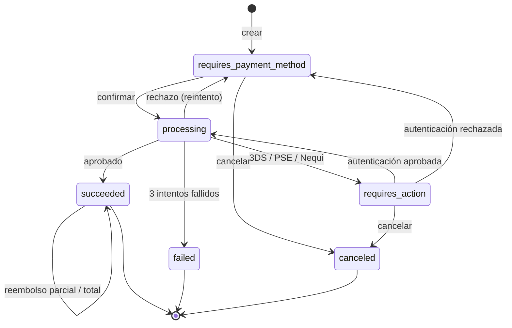

# Pasarela de pagos simulada

Simulador de una pasarela de pagos estilo Stripe, **solo en modo test** (sin dinero
real ni redes de tarjetas): comercios con llaves API, _payment intents_ con máquina de
estados, checkout alojado con tarjetas de prueba, 3DS simulado, PSE y Nequi simulados,
reembolsos, `Idempotency-Key` y webhooks firmados con HMAC-SHA256.

Stack: **NestJS 11 · PostgreSQL · Angular 22 · pnpm · Docker Compose · GitHub Actions**.

> 🚧 En construcción. Este README se completa a medida que se integran los módulos.

## Inicio rápido

```bash
cp .env.example .env
docker compose up --build
# Web: http://localhost:4200 · API: http://localhost:3000/api/v1 · Swagger: http://localhost:3000/api/docs
```

Desarrollo local (Node 24 y pnpm 10):

```bash
pnpm install
docker compose up -d postgres
pnpm --filter api migration:run
pnpm dev
```

## Autenticación

| Cliente               | Credencial                                                    |
| --------------------- | ------------------------------------------------------------- |
| Panel del comercio    | JWT de acceso (en memoria) + refresh token rotativo en cookie |
| Servidor del comercio | `Authorization: Bearer sk_test_…` (llave secreta)             |
| Checkout (navegador)  | `Authorization: Bearer pk_test_…` (llave publicable)          |

Al registrarse, el comercio recibe un par de llaves de prueba. La llave secreta se guarda
como hash SHA-256 y solo se muestra completa al rotarla
([ADR 0002](docs/adr/0002-autenticacion-panel-y-llaves-api.md)).

```bash
curl http://localhost:3000/api/v1/account -H "Authorization: Bearer sk_test_…"
```

## Pagos

Flujo típico, como en Stripe:

1. El servidor del comercio crea un _payment intent_ con su llave secreta.
2. El comprador paga en el checkout alojado, que tokeniza la tarjeta con la llave
   publicable.
3. El checkout confirma el intent con el `client_secret`.

```bash
# 1. Crear el intent (montos en unidades menores de COP: 5000000 = $ 50.000)
curl -X POST http://localhost:3000/api/v1/payment_intents \
  -H "Authorization: Bearer sk_test_…" -H "Idempotency-Key: $(uuidgen)" \
  -H "Content-Type: application/json" -d '{"amount":5000000,"description":"Pedido #1001"}'

# 2. Tokenizar la tarjeta (el número completo nunca se guarda)
curl -X POST http://localhost:3000/api/v1/payment_methods \
  -H "Authorization: Bearer pk_test_…" -H "Content-Type: application/json" \
  -d '{"type":"card","card":{"number":"4242424242424242","exp_month":12,"exp_year":2030,"cvc":"123"}}'

# 3. Confirmar desde el checkout
curl -X POST http://localhost:3000/api/v1/checkout/pi_…/confirm \
  -H "Idempotency-Key: $(uuidgen)" -H "Content-Type: application/json" \
  -d '{"client_secret":"pi_…_secret_…","payment_method":"pm_…"}'
```

### Máquina de estados



- Un rechazo del emisor responde `200` con `last_payment_error` (no es un error HTTP).
- Los reembolsos acumulan `amount_refunded` y exponen `refund_status`
  (`none`, `partial`, `full`).
- Detalles en el [ADR 0004](docs/adr/0004-payment-intents-tarjetas-e-idempotencia.md).

### Tarjetas de prueba

Cualquier fecha de vencimiento futura y cualquier CVC (3 dígitos; 4 para Amex).

| Número                | Resultado                                   |
| --------------------- | ------------------------------------------- |
| `4242 4242 4242 4242` | Aprobada (Visa)                             |
| `5555 5555 5555 4444` | Aprobada (Mastercard)                       |
| `3782 822463 10005`   | Aprobada (American Express)                 |
| `4000 0566 5566 5556` | Aprobada (Visa débito)                      |
| `4000 0027 6000 3184` | Requiere autenticación 3DS (aprobar/fallar) |
| `4000 0000 0000 0002` | Rechazada: genérico                         |
| `4000 0000 0000 9995` | Rechazada: fondos insuficientes             |
| `4000 0000 0000 0069` | Rechazada: tarjeta vencida                  |
| `4000 0000 0000 0127` | Rechazada: CVC incorrecto                   |
| `4000 0000 0000 0119` | Rechazada: error de procesamiento           |

Cualquier otro número válido (Luhn) se aprueba. También hay **PSE** (bancos ficticios
"… de Prueba", con aprobación o rechazo en una página bancaria simulada) y **Nequi**
(notificación simulada al celular).

## Decisiones de arquitectura

Ver [docs/adr](docs/adr/README.md).

## Licencia

MIT
